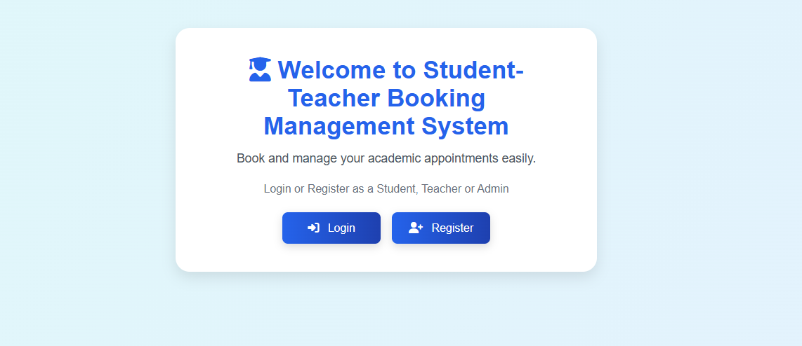
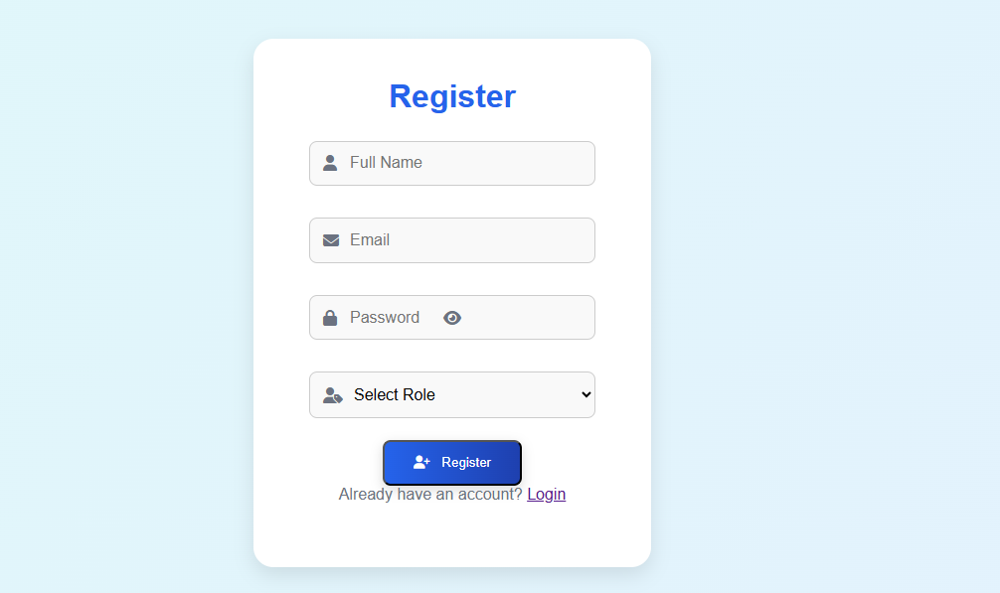
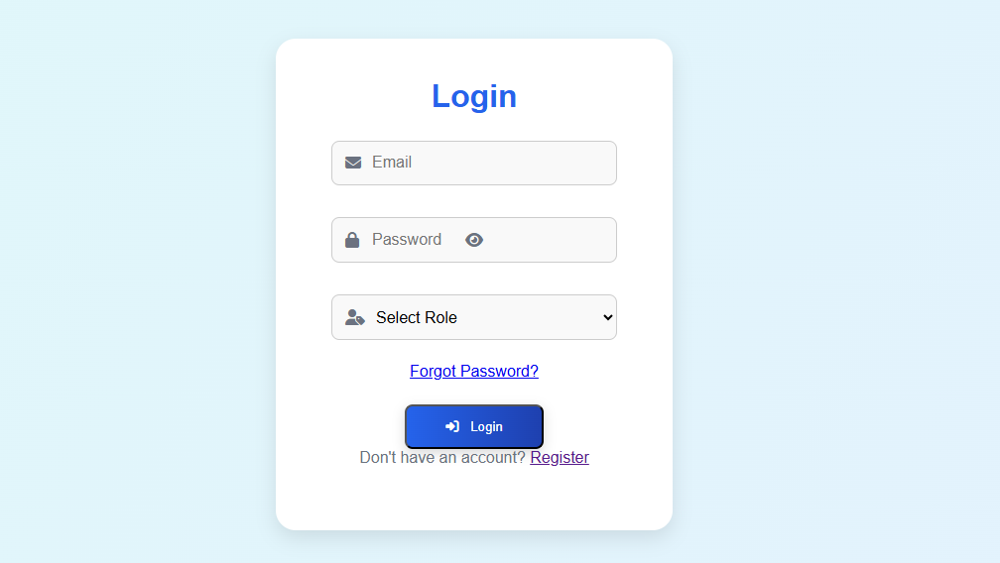
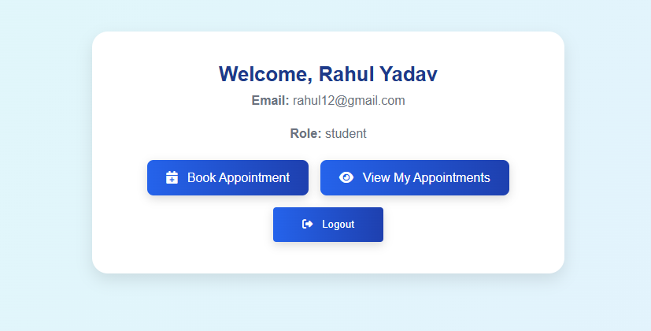
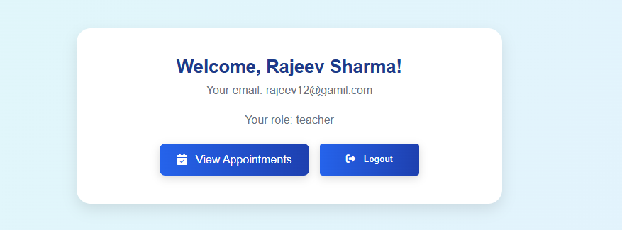
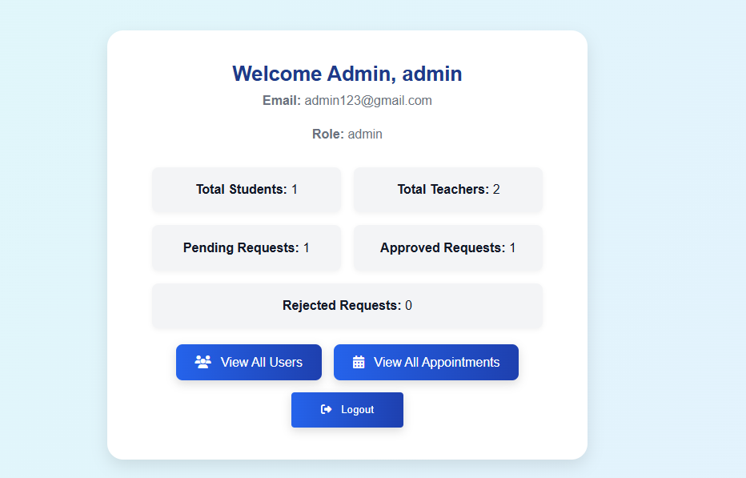

📚 STUDENT-TEACHER BOOKING MANAGEMENT SYSTEM

A web-based platform that allows to book appointments with teachers. Includes role-based dashboards for Admin, Teacher, and Student users using Firebase Authentication and Firestore.

## ✨ Features

### Authentication
- Login/Register with role selection
- Firebase Authentication
- Role-based access control

### Student Dashboard
- Book appointment with a teacher
- View appointment status(pending/ approved/ rejected)
- Cancel pending appointments
- Filter appointments by status

### Teacher Dashboard
-- View incoming appointments requests
-- Approved or reject requests
-- View student message, booking date, and subject

### Admin Dashboard
-- View total students and teachers
-- View all appointments in the system
-- Monitor pending and approved appointments
-- View all users and logs(if enabled)

---

## 🧑‍💻 Tech Stack
- **Frontend**: HTML, CSS, JavaScript
- **Backend**: Firebase
        - Authentication
        - Firestore Database

---        

## 📁 Folder Structure
/project-root
|
|--index.html
|--login.html
|--register.html
|--student.html
|--teacher.html
|--admin.html
|--book-appointment.html
|--view-status.html
|--view-appointments.html
|--all-appointments.html
|--all-users.html
|--appointments-log.html
|
|--css/
    |--style.css
|--js/
    |--app.js   #shared logic for auth, register, login, logout
    |--student.js
    |--teacher.js
    |--admin.js
    |--view-appointments.js
    |--view-status.js
    |--appointments.js
    |--all-appointments.js
    |--all-users.js
    |--appointments-log.js
|--firebase
    |--firebase-config.js     

---    

🔧 Setup Instructions
1. Clone or download this repository.
2. Replace the Firebase config in `firebase-config.js` with your own Firebase project credentials.
3. Make sure Firebase Authentication and Firebase Database are enabled in Firebase project.
4. Open `index.html` or `login.html` in your browser(via Live Server or Localhost).

---

📷 Screenshots

### First View

### Register

### Login

### Student Dashboard

### Teacher Dashboard

### Admin Dashboard

---

📌 Future Enhancements
1. Add email notifications on appointments approval/rejection.
2. Add search/filter functionality for appointments and users.
3. Export appointments reports for admin.
4. Pagination and sorting in user and appointments lists.

---

## Author

**Astha Dhiman**

---
